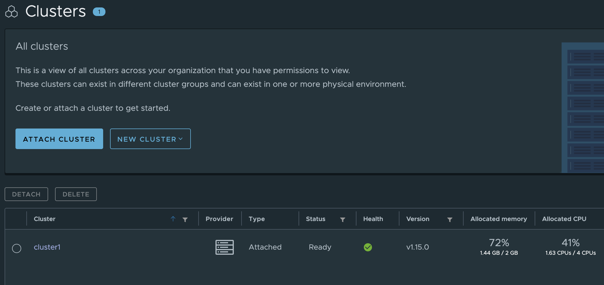
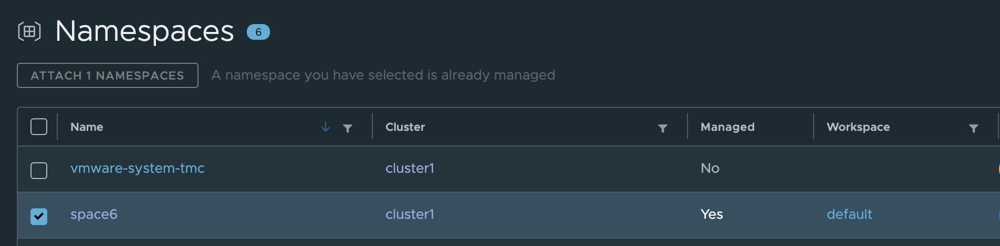
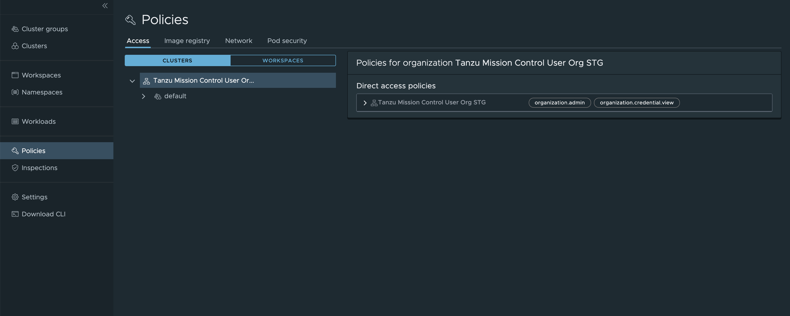
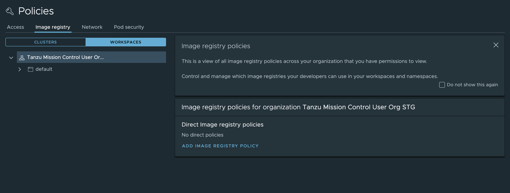
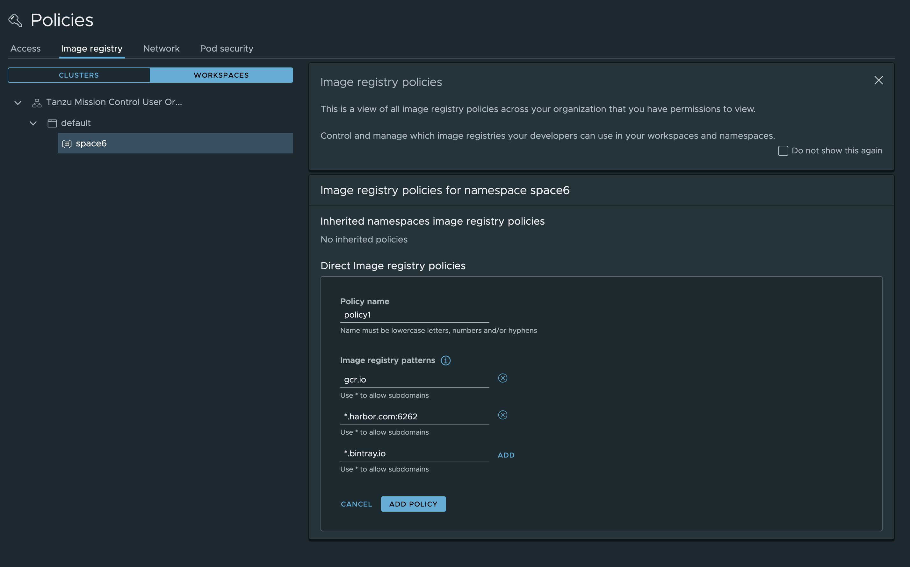
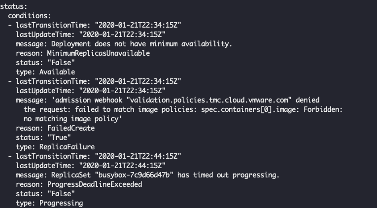

# Tanzu Mission Control - Image Policies Lab Guide

**Contents:**

- [Tanzu Mission Control - Image Policies Lab Guide](#tanzu-mission-control---image-policies-lab-guide)
  - [Introduction](#introduction)
    - [Before Attempting This Lab:](#before-attempting-this-lab)
    - [Environment Pre-Requisites](#environment-pre-requisites)
  - [Lab Exercises](#lab-exercises)
      - [Step 1: Go to the page of policies and select Image Policy](#step-1-go-to-the-page-of-policies-and-select-image-policy)
      - [Step 2: create an image policy](#step-2-create-an-image-policy)
        - [Step 2.1: Specify Wild Card matching](#step-21-specify-wild-card-matching)
        - [Step 2.2: Specify port number](#step-22-specify-port-number)
      - [Step 3: Deploying an application fails when the registry is not white listed](#step-3-deploying-an-application-fails-when-the-registry-is-not-white-listed)
      - [Step 4: Deleting the application and image policy](#step-4-deleting-the-application-and-image-policy)
      - [Step 5: Deploying an application succeeds when image policy is not present](#step-5-deploying-an-application-succeeds-when-image-policy-is-not-present)
        - [Step 5.1: Deploy the application](#step-51-deploy-the-application)
        - [Step 5.2: Validating that the application is functioning](#step-52-validating-that-the-application-is-functioning)
        - [Step 5.3: Cleaning up the application and namespace](#step-53-cleaning-up-the-application-and-namespace)
    - [Validate Lab Guide](#validate-lab-guide)
    - [Thank you for completing the Tanzu Mission Control - Image Policies Lab Guide!](#thank-you-for-completing-the-tanzu-mission-control---image-policies-lab-guide)

## Introduction

Image Policy is a type of policy that regulates the behaviors of pulling images with a whitelist of image registry patterns that represent registry domains from which images are allowed to be pulled. This document is intended to provide a guide to exploring basic usages of image policies in TMC through its UI.

### Before Attempting This Lab:

This lab has a completion difficulty of `Partial`. Please see the rubrik below for an explanation of lab completion difficulty rankings

Lab Completion Difficulty Rankings:

- Difficulty Levels:
  - `Complete`
    - A lab guide with a difficulty of `Complete` includes comprehensive, click-by-click instructions, usually with a screenshot for every command entered. Complete labs must be associated with an online lab environment fully prepped to execute the exact instructions provided in the lab guide. Most users could successfully execute the steps in a `Complete` lab guide, even if they do not have expertise in the subject, by following detailed instructions.
  - `Partial`
    - A lab guide with a difficulty of `Partial` includes full instructions to complete the exercise, with enough detail to where a user with moderate experience in the subject matter could complete the exercise. `Partial` lab guides provide a level of detail similar gto most typical technical documentation, where the user is expected to be able to configure their lab environment with dependencies required for the exercise, and to contextualize general instructions to the users own environment. 
  - `Challenge`
    - A lab guide with a difficulty of `Challenge` is designed to be technically challenging for the guide's target audience to complete. `Challenge` lab guides do not include comprehensive instructions, and intentionally leave out details required to complete exercises as a challenge or test of the users proficiency in a topic.

### Environment Pre-Requisites

The demo in this document is conducted with a development TMC stack in which a Kind cluster is attached. 

In order to demonstrate applying an image policy on a namespace, namespace space6 under the default workspace has been created using TMC. 

<details><summary>Screenshot</summary>


</details>

## Lab Exercises

#### Step 1: Go to the page of policies and select Image Policy

Go to the page of policies by clicking Policies.

<details><summary>Screenshot</summary>

</details>

Select Image Policy by clicking Image registry and then click WORKSPACES since image policies cannot be set at a cluster level.

<details><summary>Screenshot</summary>

</details>

#### Step 2: create an image policy 

Image policies can be created at an either workspace or namespace level. The policies set at a namespace and the policies set at its workspace(s) are additive for the namespace. For example, if namespace A has policy1 and namespace A's workspace E has policy2, then namespace A will have both policy1 and policy2 because it inherits policy2 from the parent workspace E.

In this step, select the workspace/namespace in which we like to set up image policies. For example, here we select the default workspace and select space6. 

After selecting the workspace namespace, image policies can be added. Click ADD POLICY after specifying policy name and image registry patterns. Each image registry pattern represents one or more registry domains from which images can be pulled for deployment in the workspace/namespace.

<details><summary>Screenshot</summary>

</details>

##### Step 2.1: Specify Wild Card matching

As shown in the screenshot above, Wild Card matching is an optional feature supported by TMC. For example, "*.bintray.io" is allowed while " abc.*.bintray.io" and " abc.*" are not allowed.

##### Step 2.2: Specify port number

As shown in the screenshot above, specifying port number such as "*.harbor.com:6262" is an optional feature supported by TMC. Specifying port is only needed for registries using non-standard ports.


#### Step 3: Deploying an application fails when the registry is not white listed

In the attached cluster, try to create a deployment in a namespace where the policy is in effect, with an image pulled from a registry not in the image policy's registry list. For example, creating a busybox deployment as shown below. This deployment will fail as the application is pulled from docker which is not whitelisted.

`kubectl apply -f imagePullingTest.yaml `

<details><summary>Expand to see contents of imagePullingTest.yaml</summary>

```yaml
apiVersion: apps/v1
kind: Deployment
metadata:
  name: busybox
  namespace: space6
spec:
  replicas: 1
  selector:
    matchLabels:
      app: test
  template:
    metadata:
      labels:
        app: test
    spec:
      containers:
        - image: busybox
          command: [ "/bin/sh", "-c", "--" ]
          args: [ "while true; printenv; do sleep 60; done;" ]
          imagePullPolicy: IfNotPresent
          name: busybox
```
</details>

We can verify enforcement by displaying the deployment status as shown below:

`kubectl get deployment busybox -n space6 -o yaml`

We can see the FailedCreate condition with a message as to which images failed to validate against the image policy: 

<details><summary>Screenshot</summary>

</details>

#### Step 4: Deleting the application and image policy

Run the command below to delete the demo deployment.

`kubectl delete -f imagePullingTest.yaml`

Delete the policy used in demo: go to the page of policies by clicking Policies in UI → click the workspace/namespace where the policy is set → click the policy and click delete.

#### Step 5: Deploying an application succeeds when image policy is not present

##### Step 5.1: Deploy the application

`kubectl apply -f imagePullingTest.yaml `

##### Step 5.2: Validating that the application is functioning

Verify that the application is working normally.

`kubectl get deployment busybox -n space6 -o yaml`

##### Step 5.3: Cleaning up the application and namespace

Clean-up the application with the following command:

`kubectl delete -f imagePullingTest.yaml`

Now delete the namespace "space6" to complete the clean-up.

### Validate Lab Guide

If you were able to complete this lab successfully without any significant problems, please sign the [validate.md](./validate.md) file located in this directory. 

If you encountered any problems or have suggestions or feature requests, please open an issue ticket on this repository. 

If you have any updates or improvements for this lab guide, please open a PR with your updates.

### Thank you for completing the Tanzu Mission Control - Image Policies Lab Guide!